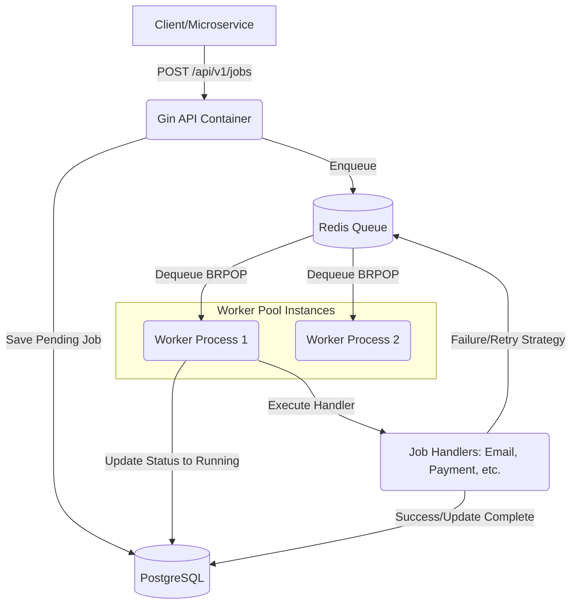

# Golang Worker Queue

An enterprise-grade, high-performance asynchronous job processing system using Golang, Redis, and PostgreSQL. Designed for scalable background job processing with fault tolerance, concurrency, and real-world system patterns like Dead Letter Queues (DLQ) and Exponential Backoff Retries.

## 🚀 Core Architecture

- **Clean Architecture**: Domain, Repository, Service, Delivery, and Worker layers.
- **Concurrency Control**: Robust worker pool utilizing Go channels and context for graceful shutdowns.
- **Distributed Locking**: Ensures no duplicate processing across multiple instances via Redis `SETNX`.
- **Scheduled Jobs**: Uses Redis Sorted Sets (`ZSET`) to handle delayed/scheduled executions seamlessly.

### Architecture Diagram



## 🛠️ Tech Stack

- **Go 1.22+**: Core language.
- **Gin**: High-performance HTTP framework for the Queue API.
- **Redis (go-redis)**: Primary messaging queue, priority queuing, and distributed locking.
- **PostgreSQL (sqlx)**: Persistent state storage for Jobs and Audit logging.
- **Zerolog**: High-performance structured JSON logging.

## 🏃 Getting Started

### 1. Start Infrastructure
```bash
make up
```
This spins up PostgreSQL and Redis via Docker Compose.

### 2. Run Database Migrations
You need `golang-migrate/migrate` installed locally.
```bash
make migrate-up
```

### 3. Start the Services
Run the API and Worker processes in separate terminal windows:
```bash
make api
make worker
```

## 📚 API Endpoints

### Create a Job (Immediate)
```bash
curl -X POST http://localhost:8080/api/v1/jobs \
-H "Content-Type: application/json" \
-d '{
  "type": "email",
  "priority": 1,
  "payload": {
    "to": "user@example.com",
    "subject": "Welcome!",
    "body": "Hello world"
  }
}'
```

## ⚙️ Advanced Features Displayed

- **Graceful Shutdown**: Intercepts `SIGTERM` and `SIGINT`, waits for active workers to finish processing their current job before exiting.
- **Distributed Scheduler**: Uses a Redis `ZSET` polled by a leader-elected scheduler (via Redis Distributed Lock) to transition delayed jobs into active queues when their time arrives.
- **Backpressure & Concurrency Limiting**: Number of workers is strictly configured via Viper, preventing unbounded Goroutine spawning and protecting external APIs.
